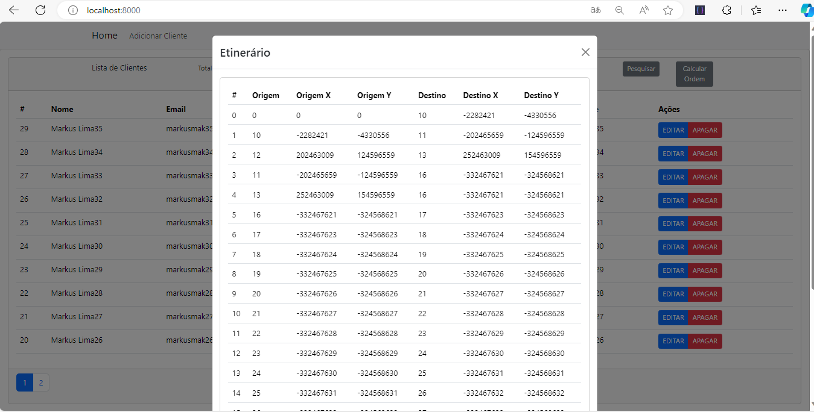

# Gerênciador de cliente com calculo de rotas

O projeto proposto tem por objetivo:
- Cadastro de clientes com NOME, EMAIL, TELEFONE, COORDENADA X e COORDENADA Y
- CRUD de clientes
- Calculo de rotas simulando um plano cartesiano

## Tecnologias Utilizadas

- Ambiente: [Linux], [Docker], [Nginx]
- Back-end: [NodeJs], [RestFull]
- Front-end: [ReactJs], [Bootstrap]
- Banco de Dados: [Postgres]

## Estrutura do Projeto

Explique a organização básica do projeto, por exemplo:

- `ambiente/`: Todo o ambiente já vem pré-montado dentro do Docker.
- `backend/`: O back foi desenvolcido em NodeJs.
- `frontend/`: O Front foi desenvolvido em Reactjs.
- `database/`: O scrip ja vem disponíbilizado dentro do código ao iniciar a aplicação para melhor comodidade, caso queira rodar na mão segue script`
``
CREATE TABLE IF NOT EXISTS clients (
        id serial PRIMARY KEY, 
        name VARCHAR (255), 
        email VARCHAR (255) UNIQUE NOT NULL, 
        phone VARCHAR (20) UNIQUE NOT NULL, 
        lat VARCHAR (30) NOT NULL, 
        long VARCHAR (30) NOT NULL
      ); 
``

## Rodar o projeto

- Como o projeto foi feito dentro de um container docker, 
  aconselho utilizar também para iniciar com mais agilidade. https://docs.docker.com/engine/install/ubuntu/
  -- Execute docker compose -f "docker-compose.yaml" up -d --build 
  --- --- Acesse com seu navegador localhost:8000

- Caso não tenha interesse com docker, o projeto terá que ser rodado manualmente,
OBS: Caso opte pode rodar sem o docker, haverá a necessidade de configura as chamadas do back end dentro do front end
no axios.

--- Instale o postgres. 
--- --- Crie um banco e rode o script para gerar a tabela. 
--- --- Dentro do diretório node/config/credencials.js sete todas as credenciais do banco

--- Instale o NodeJs (21.0).
--- --- Entre no diretório node/
--- --- Execute NPM INSTALL e depois NPM RUN START
--- --- Acesse com seu navegador ou alguma ferramenta de testes de API localhost:3000

--- Execute o React.
--- --- Entre no diretório react/
--- --- Execute NPM INSTALL e depois NPM RUN START
--- --- Acesse com seu navegador localhost:5173

## Utilização da API

- `Get /api/client`:
var requestOptions = {
  method: 'GET',
  redirect: 'follow'
};

fetch("http://localhost:8000/api/client", requestOptions)
  .then(response => response.text())
  .then(result => console.log(result))
  .catch(error => console.log('error', error));

- `Get /api/client/{id}`:
var requestOptions = {
  method: 'GET',
  redirect: 'follow'
};

fetch("http://localhost:8000/api/client/9", requestOptions)
  .then(response => response.text())
  .then(result => console.log(result))
  .catch(error => console.log('error', error));

- `Delete /api/client/{id}`:
var requestOptions = {
  method: 'DELETE',
  redirect: 'follow'
};

fetch("http://localhost:8000/api/client/9", requestOptions)
  .then(response => response.text())
  .then(result => console.log(result))
  .catch(error => console.log('error', error));

- `Put /api/client/{id}`:
var myHeaders = new Headers();
myHeaders.append("Content-Type", "application/json");

var raw = JSON.stringify({
  "name": "Markus Lima",
  "email": "markusmak@gmail.com",
  "phone": "021996575274",
  "lat": "-2282421",
  "long": "-4330556"
});

var requestOptions = {
  method: 'PUT',
  headers: myHeaders,
  body: raw,
  redirect: 'follow'
};

fetch("http://localhost:8000/api/client/10", requestOptions)
  .then(response => response.text())
  .then(result => console.log(result))
  .catch(error => console.log('error', error));

- `Post /api/client`:
var myHeaders = new Headers();
myHeaders.append("Content-Type", "application/json");

var raw = JSON.stringify({
  "name": "Markus Lima37",
  "email": "markusmak37@gmail.com",
  "phone": "021987654237",
  "lat": "-332467637",
  "long": "-32.4568637"
});

var requestOptions = {
  method: 'POST',
  headers: myHeaders,
  body: raw,
  redirect: 'follow'
};

fetch("http://localhost:8000/api/client", requestOptions)
  .then(response => response.text())
  .then(result => console.log(result))
  .catch(error => console.log('error', error));

- `Get /api/calc`:
var requestOptions = {
  method: 'GET',
  redirect: 'follow'
};

fetch("http://localhost:8000/api/calc", requestOptions)
  .then(response => response.text())
  .then(result => console.log(result))
  .catch(error => console.log('error', error));
Explique como usar a API, incluindo endpoints principais, autenticação, etc.

## Preview do Projeto

## Rotas do Front end

- `GET /`: Rota Inicial.
- `POST /post`: Formulário.
